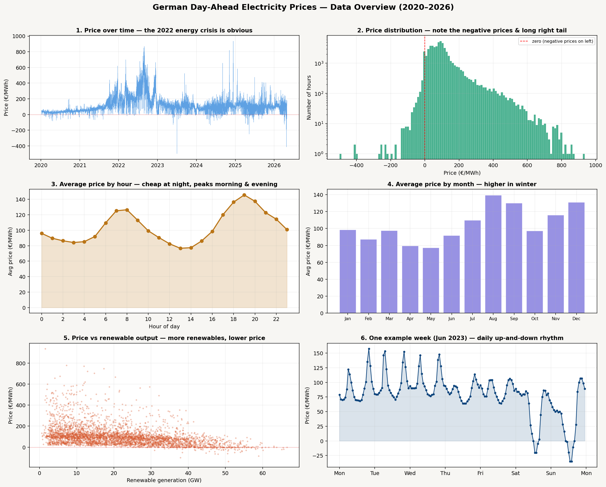

# Making the Plots Visible on GitHub

This describes what the code actually does. Every claim here was checked
against the source.

## Where files go

The setup cell resolves **one writable working directory** and points both
`DATA_DIR` and `DOCS_DIR` at it. That single directory is deliberate: the
pipeline reads and writes through the same two names — Part 1 reads the CSV from
`DATA_DIR` and writes `data_part1.pkl` back to it — so splitting them apart
breaks one or the other.

| Environment | `WORK_DIR` | Sources linked in |
|---|---|---|
| Kaggle | `/kaggle/working` | every attached dataset under `/kaggle/input` |
| Local | `$EPF_OUT`, else `<repo>/outputs` | `data/`, `files/`, `figures/`, `src/` |

Read-only sources are **symlinked into** `WORK_DIR` at setup, so
`os.path.join(DATA_DIR, "data_part2.pkl")` resolves whether that file is a
committed input or something the run just produced. `outputs/` is gitignored.

On Kaggle the mount layout is discovered by walking `/kaggle/input`, because
attached datasets appear at `/kaggle/input/<slug>` on older images and at
`/kaggle/input/datasets/<owner>/<slug>` on current ones. Nothing hardcodes
either shape.

To send figures somewhere else locally:

```bash
EPF_OUT=/tmp/epf_run python run_all.py
```

## What the code produces

Every figure is a Plotly figure written with:

```python
fig.write_html(save_path)
```

`write_html` defaults to `include_plotlyjs=True`, so each file embeds a full
copy of plotly.js — that is why nearly every HTML file is ~4.4 MB regardless of
how much data it plots.

**No PNG is generated by this code.** There is no `write_image` or `to_image`
call anywhere in `src/` or the notebook. `kaleido>=1.0` is in
`requirements.txt` but nothing calls it. The 12 PNGs committed in `figures/`
were produced outside this pipeline and a fresh run will not reproduce them.

## What renders where

- **PNGs** render inline in GitHub's file viewer and embed in Markdown:

  ```markdown
  
  ```

- **Interactive HTML** does **not** render on github.com — it is served as raw
  text or a download. Three ways to view it:

  1. **Download** the file and open it locally.
  2. **GitHub Pages** — enable Pages, then files are live at
     `https://islamriajul.github.io/german-electricity-regime-aware-bayesian-uncertainty/figures/part3_data_overview.html`
  3. **htmlpreview** — prefix the blob URL:
     `https://htmlpreview.github.io/?https://github.com/islamRiajul/german-electricity-regime-aware-bayesian-uncertainty/blob/main/figures/part3_data_overview.html`
     (struggles with multi-MB files; Pages is more reliable)

- **The notebook itself.** GitHub renders committed notebook outputs, but a
  Plotly figure using the default `notebook`/`iframe` renderer stores nothing
  GitHub can draw. `GITHUB_STATIC` exists for this:

  ```python
  GITHUB_STATIC = False   # -> renderer 'svg' when True
  ```

  Set it to `True` and re-run all cells before committing, and each figure is
  baked in as a static SVG visible on the repo page. It ships as `False`, so the
  committed notebook shows no plots.

  Static mode needs a working kaleido. Kaleido 1.x requires plotly >= 6.1.1 —
  `requirements.txt` pins both, but check your environment matches, since an
  older plotly with kaleido 1.x fails at export time:

  ```bash
  python3 -c "import plotly; print(plotly.__version__)"
  ```

  Note also that `.gitignore` excludes `German_Electricity_Uncertainity.executed.ipynb`,
  the output of `run_all.py`, so the executed copy never reaches GitHub.

## Adding PNGs

`kaleido` is already a dependency. Replace `fig.write_html(save_path)` with a
helper to get both formats and a far smaller repo:

```python
def save_fig(fig, save_path, png=True, cdn=True):
    fig.write_html(save_path, include_plotlyjs="cdn" if cdn else True)
    if png:
        fig.write_image(save_path.replace(".html", ".png"), scale=2)
```

## Note on file size

The committed HTML files embed plotly.js, which is why `figures/` is ~161 MB of
this repo's ~226 MB. `include_plotlyjs="cdn"` drops each file to tens of
kilobytes — roughly 70 MB total — at the cost of needing a network connection to
render. Keeping only PNGs in git and regenerating HTML via `run_all.py` is the
other option.

## Running on Kaggle

The notebook is published at
[kaggle.com/code/mdriajuliislam/german-electricity-regime-aware-bayesian](https://www.kaggle.com/code/mdriajuliislam/german-electricity-regime-aware-bayesian)
with two datasets attached:

- `mdriajuliislam/german-electricity-dataset` — the raw SMARD CSV
- `mdriajuliislam/german-epf-research` — `german_epf_research.py`

The models are pure NumPy/SciPy, so enabling a GPU accelerator does nothing; a
full run is CPU-bound and takes a couple of hours.
