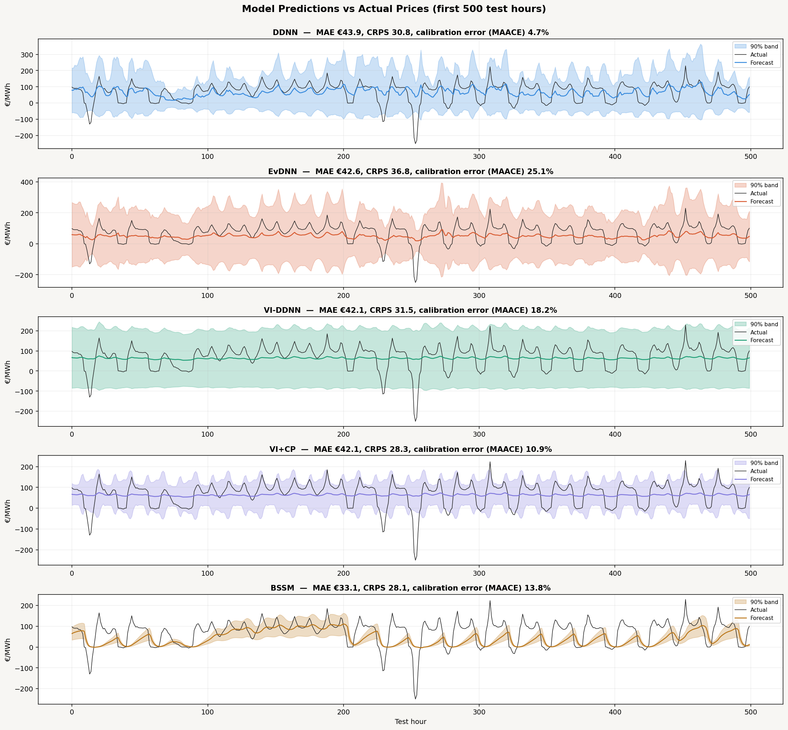

# Making the Plots Visible on GitHub

The notebook produces **interactive Plotly figures** and exports them to
`figures/` as both `.html` (fully interactive) and `.png` (static). Here is how
each shows up once the repo is on GitHub.

## What renders where

- **Static `.png` images** render inline in the GitHub file viewer and can be
  embedded directly in Markdown, e.g.:

  ```markdown
  
  ```

- **Interactive `.html` files** do **not** render on github.com — GitHub serves
  them as raw text/downloads. To view them interactively you have three options:

  1. **Download** the `.html` and open it in a browser.
  2. **GitHub Pages** — enable Pages for the repo, then the files are live at
     `https://<user>.github.io/<repo>/figures/part3_data_overview.html`.
  3. **htmlpreview** — prefix the raw URL:
     `https://htmlpreview.github.io/?https://github.com/<user>/<repo>/blob/main/figures/part3_data_overview.html`

## Recommended README embeds

Use the PNGs for anything you want visible directly on the repo page, and link
to the HTML for the interactive version. Example:

```markdown
### Prediction dashboard

[▶ Interactive version](figures/part9_predictions.html)
```

## Note on file size

The interactive `.html` files embed the full Plotly.js library, so each is a few
MB. They are committed here for convenience; if you ever want a lighter repo,
regenerate them with `include_plotlyjs="cdn"` or keep only the PNGs and
regenerate HTML on demand via `run_all.py`.
